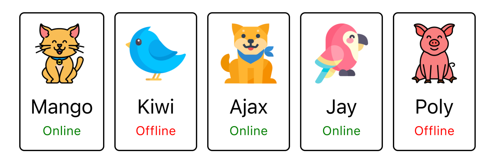

# Домашнє завдання `goit-react-hw-01`

## Завдання 1 - Профіль соціальної мережі

Необхідно створити компонент `<Profile>`, за допомогою якого ми могли б відображати інформацію про користувача соціальної мережі.


Компонент повинен приймати кілька пропсів з інформацією про користувача:
- `name` — ім'я користувача
- `tag` — тег в соціальній мережі без `@`
- `location` — місто і країна
- `image` — посилання на зображення
- `stats` — об'єкт з інформацією про активності

Компонент повинен створювати розмітку наступної структури, але з динамічними даними, що надходять у вигляді описаних раніше пропсів.

```html
<div>
  <div>
    
    <p>Petra Marica</p>
    <p>@pmarica</p>
    <p>Salvador, Brasil</p>
  </div>

  <ul>
    <li>
      <span>Followers</span>
      <span>1000</span>
    </li>
    <li>
      <span>Views</span>
      <span>2000</span>
    </li>
    <li>
      <span>Likes</span>
      <span>3000</span>
    </li>
  </ul>
</div>
```
Приведений нижче є приклад використання компонента `Profile` у компоненті `App`:
- Рендеримо компонент `Profile` всередині `App`
- Передаємо компоненту `Profile` дані у вигляді пропсів

Використовуйте ці дані користувача у своїй роботі для значень пропсів.

```js
const userData = {
  username: "Jacques Gluke",
  tag: "jgluke",
  location: "Ocho Rios, Jamaica",
  avatar: "https://cdn-icons-png.flaticon.com/512/2922/2922506.png",
  stats: {
    followers: 5603,
    views: 4827,
    likes: 1308
  }
};


const App = () => {
  return (
    <>
      <Profile
        name={userData.username}
        tag={userData.tag}
        location={userData.location}
        image={userData.avatar}
        stats={userData.stats}
      />
    </>
  );
};
```
Треба винести дані користувача в `JSON`-файл, щоб не завантажувати компонент `App`. Наприклад, створіть у папці `src` файл `userData.json`, перенесіть туди дані користувача, відформатуйте їх у формат `JSON`, а потім імпортуйте його в `App`, щоб передати ці дані через пропси.

```js
import userData from "../userData.json";

const App = () => {
  return (
    <>
      <Profile
        name={userData.username}
        tag={userData.tag}
        location={userData.location}
        image={userData.avatar}
        stats={userData.stats}
      />
    </>
  );
};
```

## Завдання 2 - Список друзів

Необхідно створити компонент `<FriendList>`, за допомогою якого ми могли б відображати інформацію про друзів користувача.



Компонент `<FriendList>` повинен приймати один проп `friends` - масив об'єктів друзів та створювати `DOM` розмітку наступної структури.

```html
<ul>
	{/* Кількість li залежить від кількості об'єктів в масиві */}
	<li>
		<FriendListItem />
	</li>
</ul>
```
Компонент `<FriendListItem>` - це картка одного друга, яка повинна приймати кілька пропсів:
- `avatar` - посилання на аватар
- `name` - ім'я друга
- `isOnline` - буль, що сигналізує про стан друга: в мережі або ні.

Компонент `<FriendListItem>` повинен створювати `DOM` розмітку наступної структури.

```html
<div>
  
  <p>Friend name</p>
  <p>Friend status</p>
</div>
```
Залежно від пропа `isOnline`, текст в `p.status` повинен змінюватися, а його колір тексту - також. Якщо значення `true`, то текст `Online` і колір тексту зелений, в іншому випадку текст `Offline` і червоний колір тексту. Це можна зробити за допомогою різних `CSS`-класів.

Приклад використання компонента `FriendList` в компоненті `App`. Дані про друзі це масив об'єктів із відомими властивостями. Використовуй ці дані в своїй роботі для значень пропсів.

```js
const friends = [
  {
    avatar: "https://cdn-icons-png.flaticon.com/512/1998/1998592.png",
    name: "Mango",
    isOnline: true,
    id: 1812
  },
  {
    avatar: "https://cdn-icons-png.flaticon.com/512/616/616438.png",
    name: "Kiwi",
    isOnline: false,
    id: 1137
  },
  {
    avatar: "https://cdn-icons-png.flaticon.com/512/1623/1623681.png",
    name: "Ajax",
    isOnline: true,
    id: 1213
  },
  {
    avatar: "https://cdn-icons-png.flaticon.com/512/2977/2977285.png",
    name: "Jay",
    isOnline: true,
    id: 1714
  },
  {
    avatar: "https://cdn-icons-png.flaticon.com/512/1998/1998749.png",
    name: "Poly",
    isOnline: false,
    id: 1284
  }
];

const App = () => {
  return (
    <>
      <FriendList friends={friends} />
    </>
  );
};
```
Треба винести дані про друзів в `JSON`-файл, щоб не ускладнювати компонент `App`. Наприклад, створіть у папці `src` файл `friends.json`, перемістіть туди масив друзів, форматуючи дані під формат `JSON`, і потім імпортуйте його в `App`, щоб передати ці дані пропсами.

```js
import userData from "../userData.json";
import friends from "../friends.json";

const App = () => {
  return (
    <>
      <Profile
        name={userData.username}
        tag={userData.tag}
        location={userData.location}
        image={userData.avatar}
        stats={userData.stats}
      />
      <FriendList friends={friends} />
    </>
  );
};
```
## Завдання 3 - Історія транзакцій
Необхідно створити компонент історії транзакцій в особистому кабінеті інтернет-банку.


Дані для списку доступні у форматі массива об'єктів, де кожен об'єкт описує одну транзакцію з наступними властивостями:
- `id` — унікальний ідентифікатор транзакції
- `type` — тип транзакції
- `amount` - сума транзакції
- `currency` - тип валюти

Необхідно створити компонент `<TransactionHistory>`, який приймає один проп `items` - масив об'єктів транзакцій. Компонент створює розмітку таблиці. Кожна транзакція - це рядок таблиці. У прикладі наведена розмітка двох транзакцій.

```html
<table>
  <thead>
    <tr>
      <th>Type</th>
      <th>Amount</th>
      <th>Currency</th>
    </tr>
  </thead>

  <tbody>
    <tr>
      <td>Invoice</td>
      <td>125</td>
      <td>USD</td>
    </tr>
    <tr>
      <td>Withdrawal</td>
      <td>85</td>
      <td>USD</td>
    </tr>
  </tbody>
</table>
```
Приклад використання компонента `TransactionHistory` у компоненті `App`. Використовуйте ці дані у своїй роботі для значень пропсів.

```js
const transactions = [
  {
    id: "1e0700a2-5183-4291-85cc-2065a036a683",
    type: "invoice",
    amount: "964.82",
    currency: "LRD",
  },
  {
    id: "a30f821b-4d25-4ff0-abdd-e340b3f0dd2b",
    type: "payment",
    amount: "686.50",
    currency: "WST",
  },
  {
    id: "44dca67a-8e5a-4798-bf8e-b15efd4e1abd",
    type: "invoice",
    amount: "828.62",
    currency: "UGX",
  },
  {
    id: "ea8ed3dc-2b68-4a53-905a-53ecb0adef33",
    type: "withdrawal",
    amount: "527.80",
    currency: "ALL",
  },
  {
    id: "63ca02f9-d637-46b5-9237-f3b24425e029",
    type: "payment",
    amount: "862.44",
    currency: "AUD",
  },
  {
    id: "ed0263e8-59a5-4bf1-87e0-2bb88e53dc34",
    type: "withdrawal",
    amount: "907.00",
    currency: "GEL",
  },
  {
    id: "4eaab41b-b967-40ac-82ed-85fc66f646f1",
    type: "deposit",
    amount: "103.10",
    currency: "BWP",
  },
  {
    id: "9648a350-8469-42d5-8bf3-18090de5fe67",
    type: "withdrawal",
    amount: "322.32",
    currency: "MRO",
  },
  {
    id: "9c5c25fb-1a95-4b2f-8d1f-4c4426d677cc",
    type: "invoice",
    amount: "14.79",
    currency: "PYG",
  }
];

const App = () => {
  return (
    <>
      <TransactionHistory items={transactions} />
    </>
  );
};
```

Треба винести дані про транзакції у `JSON`-файл, щоб не захламлювати компонент `App`. Наприклад, створіть файл із назвою `transactions.json` у папці `src`, перемістіть туди масив транзакцій, відформатуйте дані у формат `JSON`, а потім імпортуйте його в компонент `App`, щоб передати ці дані як пропси.

```js
import userData from "../userData.json";
import friends from "../friends.json";
import transactions from "../transactions.json";


const App = () => {
  return (
    <>
      <Profile
        name={userData.username}
        tag={userData.tag}
        location={userData.location}
        image={userData.avatar}
        stats={userData.stats}
      />
      <FriendList friends={friends} />
      <TransactionHistory items={transactions} />
    </>
  );
};
```
